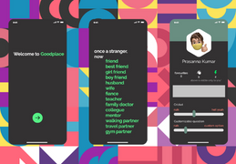

<!DOCTYPE html>
<html lang="en">
    <head>
        <meta charset="8" />
        <meta name="viewport" content="width=device-width, initial-scale=1.0" />
        <meta http-equiv="X-UA-Compatible" content="ie-edge" />
        <title>Prasanna Kumar</title>
        <link rel="stylesheet" href="assets/css/style.css" />
    </head>
    <body>
        

            

                <nav>
                    

                        Prasanna Kumar
                    

                    <ul class="nav-items">
                        <li>
                            <a href="index.html">work</a>
                        </li>
                        <li>
                            <a href="about.html">about</a>
                        </li>
                        <li>
                            <a href="contact.html">contact</a>
                        </li>
                    </ul>
                </nav>
            

        

        

            

                <header>
                    

                        <h1 style>Hi, I'm Prasanna</h1>
                        

                            I'm Passionate about building products that users love.  
                        

                    

                
                    
                    

                        
                        

                    

                </header> 
            

        

        

            

              
              

                <h5 class="card-title">My experience interning with MAD as a design intern</h5>
              

            

            

              
              

                <h5 class="card-title">About our venture, how we went beyond screens and designs!</h5>
                

            

            

              
              

                <h5 class="card-title">A product story: Lessons we learned from developing the mobile App</h5>
              

            

          

           

        

            
You can find me on <a href="https://www.linkedin.com/in/prasanna-kumar-108a65126/"> LinkedIn </a> 

            
        

        
    </body>
</html>
